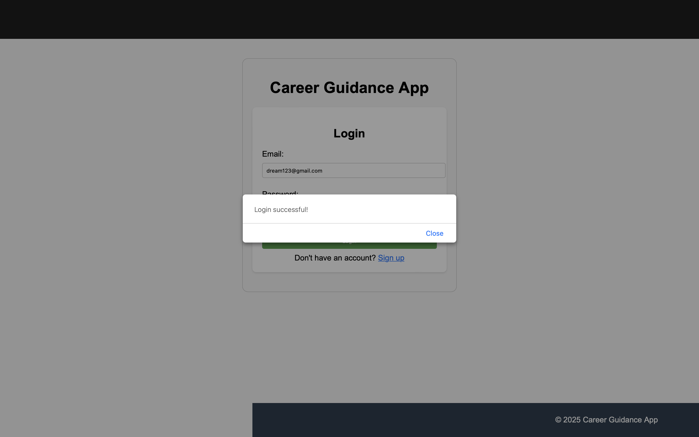
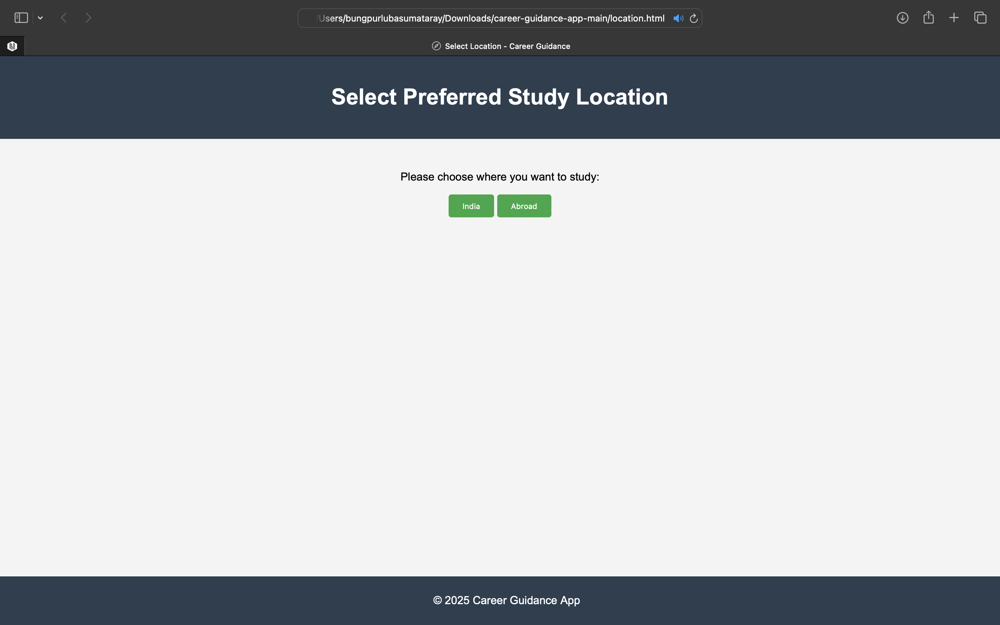
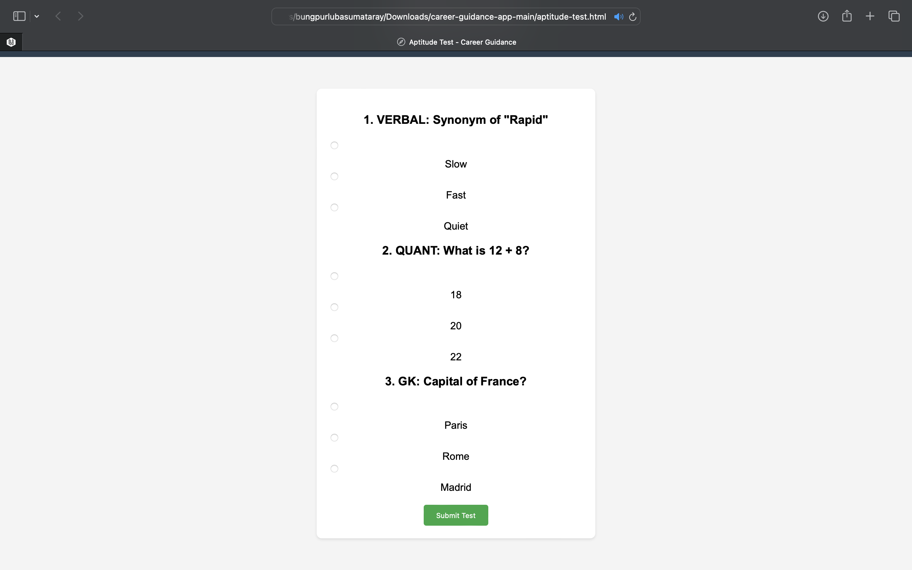

# 🎓 Career Guidance Web App

This is a web-based application designed to help students and parents explore suitable colleges and courses based on eligibility, preferences, and aptitude. It supports career planning by filtering college options in India and abroad.

---

## 👨‍🎓 Features

- ✅ Student Sign-Up and Login using Firebase Authentication  
- 🌍 College selection by location (India or Abroad)  
- 🎯 College list filtered by eligibility, CGPA, entrance exam, and preferences  
- 🧠 Aptitude Test with Verbal, Quantitative, and General Knowledge sections  
- 🔐 Firebase Authentication  
- 🌐 Firebase Hosting-ready  

---

## 🛠️ Technologies Used

- HTML5  
- CSS3  
- JavaScript (Vanilla JS)  
- Firebase (Authentication & Hosting)

---

## 🚀 How to Run the Project

1. Clone or download the repository ZIP  
2. Open `index.html` in a browser (preferably Google Chrome)  
3. Ensure you're connected to the internet (Firebase SDK requires it)  
4. To use full login/signup flow, use a local server like VS Code Live Server  
5. Optional: deploy using Firebase Hosting for full online experience

---

## 🔐 Firebase Project

- Firebase Project ID: `career-guidance-a3bc4`  
- Firebase Authentication: **Email/Password** enabled  
- Firestore ready for data storage (user info, test results, etc.)

---

## 🖼️ Screenshots

### 🔐 Signup Form  

### ✅ Signup Success  

### 📋 Firebase Console: Registered Users  

### 🔑 Login Form  

### ✅ Login Success  

### 📍 Location Selection  

### 🇮🇳 Colleges in India  

### 🌏 Colleges Abroad  

### 🧠 Aptitude Test  

### ✅ Test Completed  

### 🏠 Home Page  

---

## 📄 Internship Project Details

- **Project Title:** Career Guidance Web App  
- **Domain:** Education  
- **Difficulty Level:** Medium  
- **University:** Assam Down Town University  
- **Student:** Bungpurlu Basumatary  
- **Course:** BTech CTIS – 3rd Semester  

---

## ✅ Project Status

Project is **under development**.  
Core features like student authentication, college filtering, and aptitude testing are implemented and integrated with Firebase.

---

© 2025 Bungpurlu Basumatary. Internship project for educational use.
